# **Module17-Credit_Risk_Analysis**
# **Supervised Machine Learning**

## **Overview of the Analysis**

### The purpose of this analysis is determine credit card risk by employing different techniques to train and evaluate models with unbalanced classes.
###     1. We oversampled the data using the RandomOverSampler and SMOTE algorithms, and undersampled the data using the ClusterCentroids algorithm.
###     2. Then, we used a combinatorial approach of over- and undersampling using the SMOTEENN algorithm.  
###     3. Finally, we compared two new machine learning models that reduce bias, BalancedRandomForestClassifier and EasyEnsembleClassifier, to predict credit risk.  
###     4. Last but not least, we evaluated the performance of these models and determined whether they should be used to predict credit risk.

## **Results**

## **RandomOverSampler model**

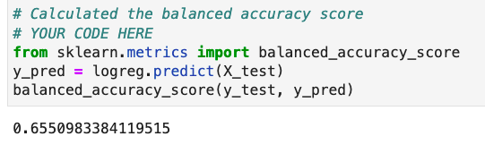

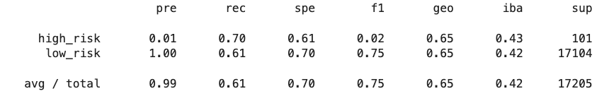

### Naive Random Oversampling results: The balanced accuracy test it 65.5%, the precision for the high_risk has a very low positivity at 1% and the recall is 70%, and the avg/total precision is 99% with the recall at 61%.

## **SMOTE model**

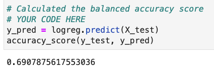

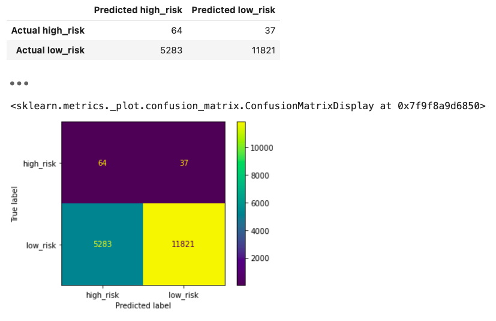

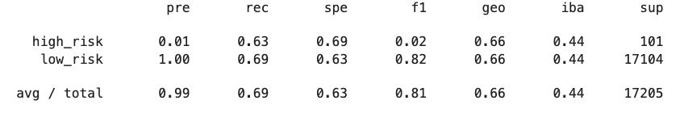

### SMOTE oversampling results: The balanced accuracy score is 69%, the precision for the high_risk loans has a low positvity again at 1% and recall is 63%, and the avg/total precision is 99% with the recall at 69%.

## **ClusterCentroids model**

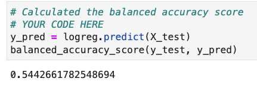

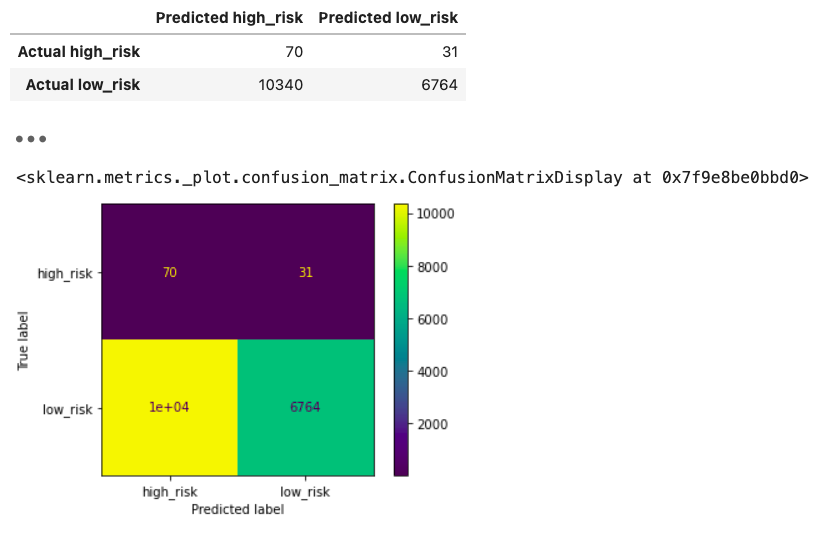

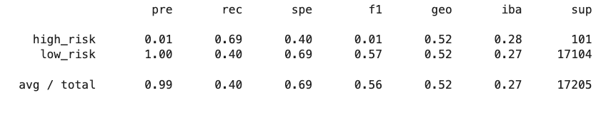

### ClusterCentroids results: The balanced accuracy score is 54.4%, the precision for the high_risk loans has a low positvity again at 1% and recall is 69%, and the avg/total precision is 99% with the recall at 40%.

## **SMOTEENN model**

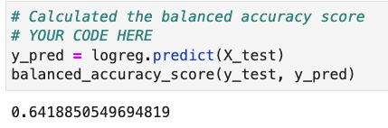

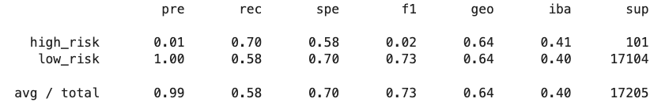

### SMOTEEN results: The balanced accuracy score is 64.2%%, the precision for the high_risk loans has a low positvity at 1% and recall is 70%, and the avg/total precision is 99% with the recall at 58%.

## **BalancedRandomForestClassifier model**

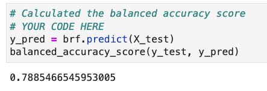

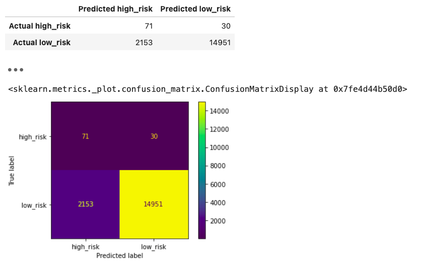

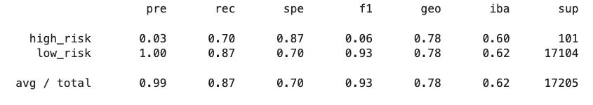

### BalancedRandomForestClassifier results: The balanced accuracy score is 78.9%%, the precision for the high_risk loans has a positvity at 3% and recall is 70%, and the avg/total precision is 99% with the recall at 87%.

## **EasyEnsembleClassifier model**

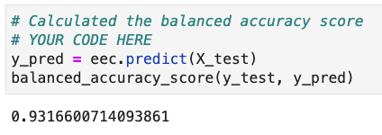

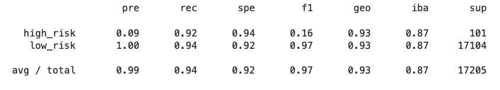

### EasyEnsembleClassifier results: The balanced accuracy score is 93.2%%, the precision for the high_risk loans has a positvity at 9% and recall is 92%, and the avg/total precision is 99% with the recall at 94%.

## **Summary**

### In the first four models we undersampled, oversampled and did a combination of both to try and determine which model is best at predicting which loans are the highest risk.  The next two models we resampled the data using ensemble classifiers to try and predict which which loans are high or low risk.

### In the first four models the accuracy scores are not as high as the ensemble models. The recall in the oversampling/undersampling/mixed models scores are low as well. Typically in your models you want a good balance of recall and precision which is why I recommend the ensemble classifiers over the first four models. It appears that the Easy Ensemble Classifier has the best balance of all the models because of it's high accuracy score and good balance of precision and recall scores.

