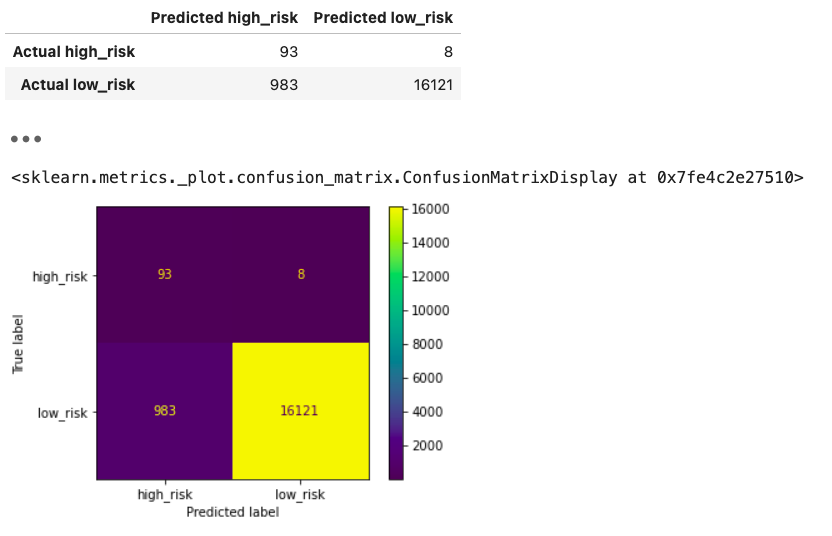

# **Module17-Credit_Risk_Analysis**
# **Supervised Machine Learning**

## **Overview of the Analysis**

## **RandomOverSampler model**

## **SMOTE model**

## **ClusterCentroids model**

## **SMOTEENN model**

## **BalancedRandomForestClassifier model**

## **EasyEnsembleClassifier model**

